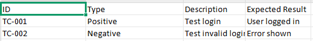

# AI-Assisted Test Case Generator-V1.0

## Overview

This project is a Python-based tool that converts software requirements into structured test cases.
It generates **positive, negative, and boundary test scenarios** and exports them into **JSON and Excel formats**.

The goal of this project is to simulate a real QA automation workflow and prepare for future AI-assisted test design.

---

## Features

* Requirement-based test case generation
* Rule-based classification (password, login, registration)
* Structured test case output (ID, type, description, expected result)
* JSON export for data processing
* Excel export for QA-friendly reporting
* Modular Python architecture

---

## Example Input

User requirement:

```
User can reset password using email
```

---

## Example Output

| ID     | Type     | Description                                 | Expected Result            |
| ------ | -------- | ------------------------------------------- | -------------------------- |
| TC-001 | Positive | Verify password reset with valid email      | Email is sent successfully |
| TC-002 | Negative | Verify password reset with invalid email    | Error message displayed    |
| TC-003 | Boundary | Verify password reset with max email length | System handles input       |

---

## Tech Stack

* Python 3.13
* openpyxl (Excel export)
* JSON (data serialization)

---

## Project Structure

```

ai-testcase-generator/
│
├── README.md
├── .gitignore
├── requirements.txt
├── main.py
├── generator.py
├── models.py
├── excel_exporter.py
├── output/
└── screenshots/
```

---

## How to Run

```bash
python main.py
```

---

## Future Improvements

* AI-based test case generation (LLM integration)
* Requirement analysis (missing edge cases detection)
* Coverage scoring system
* Web interface (FastAPI)
* Database storage (SQLite)

---

## Author

Zsebe Szilard, QA Engineer transitioning into Test Automation & AI-assisted QA tooling.

## Sample Output




# AI-Assisted Test Case Generator-V1.1

## Overview

This project is a Python-based tool that converts software requirements into structured test cases.

The application generates Positive, Negative, and Boundary test scenarios, assigns sequential Test Case IDs, stores generated results in a SQLite database, and exports the final output into JSON and Excel formats.

The project was created to simulate a real-world QA workflow and serves as a foundation for future AI-assisted test design and automated test generation.

## Features
## Test Case Generation
* Requirement-based test case generation
* Positive, Negative, and Boundary scenario creation
* Rule-based requirement classification
* Sequential Test Case ID generation
## Persistence & Caching
* SQLite database integration
* Requirement-based caching
* Reuse of previously generated test cases
* Normalized requirement matching to prevent duplicates
## Export Capabilities
* JSON export
* Excel export using OpenPyXL
* Structured output suitable for QA reporting
## Architecture
* Modular Python design
* Separation of generation, persistence, and export layers
* Extensible structure for future AI integration

  ---
## Example Input
User can reset password using email

 ---
## Example Output
ID	Type	Description	Expected Result
---
| ID     | Type     | Description                                 | Expected Result            |
| ------ | -------- | ------------------------------------------- | -------------------------- |
| TC-001 | Positive | Verify password reset with valid email      | Email is sent successfully |
| TC-002 | Negative | Verify password reset with invalid email    | Error message displayed    |
| TC-003 | Boundary | Verify password reset with max email length | System handles input       |


---
## Debugging & Development Journey

During development several real-world issues were identified and resolved.

## 1. Excel Export Permission Error

## Issue
```
PermissionError: [Errno 13] Permission denied
```
## Root Cause

The Excel file was open while the script attempted to overwrite it.

## Resolution

Closed the workbook before export and verified file locking behavior.

---

## 2. Incorrect Test Case Count

## Issue

Expected:
```
9 test cases
```
Observed:
```
Missing TC-004
```
Example:
```
TC-001
TC-002
TC-003
TC-005
TC-006
TC-007
TC-008
TC-009
TC-010
```
## Investigation

The issue initially appeared to be an incorrect number of generated test cases.

## Finding

The actual problem was a gap in Test Case ID allocation caused by previous database state and ID management logic.

## 3. Refactoring Test Case ID Assignment

## Issue

ID generation was tightly coupled with test case creation.

## Improvement

Introduced a dedicated ID assignment layer.

Current flow:
```
Generate Test Cases
        ↓
Assign IDs
        ↓
Save to SQLite
        ↓
Export Results
```
This separation improves maintainability and prepares the project for future AI-generated test cases.

## 4. SQLite Cache Validation

Implemented requirement caching to avoid regenerating identical requirements.

Workflow:
```
Requirement
      ↓
Check SQLite Cache
      ↓
Found?
 ├─ Yes → Return Existing Test Cases
 └─ No  → Generate New Test Cases
              ↓
          Save to Database
```
Benefits:

* Faster execution
* Consistent outputs
* Reduced duplicate processing
5. Requirement Classification Fix

## Issue

Requirements containing both:
```
login
password
```
were incorrectly classified as password-reset requirements.

Example:
```
User can login with username and password
```
was matching:
```
if "password" in requirement
```
before the login condition.

## Resolution

Adjusted requirement matching logic to correctly classify login-related requirements.

## Technologies Used
Python 3.13
SQLite
OpenPyXL
JSON
Pathlib

---

## Project Structure
```
AI_Assisted_Test_Case_Generator/
│
├── data/
│   ├── requirements.json
│   └── tc.db
│
├── src/
│   ├── main.py
│   ├── generator.py
│   ├── models.py
│   ├── tc_id_service.py
│   └── excel_exporter.py
│
├── test_cases.json
├── test_cases.xlsx
├── README.md
└── screenshots/
```
## How to Run
```
python src/main.py
```
## Future Improvements
* AI/LLM-based test case generation
* Requirement quality analysis
* Missing test scenario detection
* Duplicate test case detection
* FastAPI REST API
* Web UI
* Automated unit tests
* CI/CD pipeline
* Docker support
## Author

## Szilard Zsebe
QA Engineer transitioning into Test Automation and AI-Assisted QA Engineering.

## Sample Output


