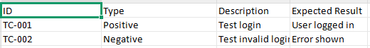

# AI-Assisted Test Case Generator-V1.0

## Overview

This project is a Python-based tool that converts software requirements into structured test cases.
It generates **positive, negative, and boundary test scenarios** and exports them into **JSON and Excel formats**.

The goal of this project is to simulate a real QA automation workflow and prepare for future AI-assisted test design.

---

## Features

* Requirement-based test case generation
* Rule-based classification (password, login, registration)
* Structured test case output (ID, type, description, expected result)
* JSON export for data processing
* Excel export for QA-friendly reporting
* Modular Python architecture

---

## Example Input

User requirement:

```
User can reset password using email
```

---

## Example Output

| ID     | Type     | Description                                 | Expected Result            |
| ------ | -------- | ------------------------------------------- | -------------------------- |
| TC-001 | Positive | Verify password reset with valid email      | Email is sent successfully |
| TC-002 | Negative | Verify password reset with invalid email    | Error message displayed    |
| TC-003 | Boundary | Verify password reset with max email length | System handles input       |

---

## Tech Stack

* Python 3.13
* openpyxl (Excel export)
* JSON (data serialization)

---

## Project Structure

```

ai-testcase-generator/
│
├── README.md
├── .gitignore
├── requirements.txt
├── main.py
├── generator.py
├── models.py
├── excel_exporter.py
├── output/
└── screenshots/
```

---

## How to Run

```bash
python main.py
```

---

## Future Improvements

* AI-based test case generation (LLM integration)
* Requirement analysis (missing edge cases detection)
* Coverage scoring system
* Web interface (FastAPI)
* Database storage (SQLite)

---

## Author

Zsebe Szilard, QA Engineer transitioning into Test Automation & AI-assisted QA tooling.

## Sample Output




# AI-Assisted Test Case Generator-V1.1

## Overview

This project is a Python-based tool that converts software requirements into structured test cases.

The application generates Positive, Negative, and Boundary test scenarios, assigns sequential Test Case IDs, stores generated results in a SQLite database, and exports the final output into JSON and Excel formats.

The project was created to simulate a real-world QA workflow and serves as a foundation for future AI-assisted test design and automated test generation.

## Features
## Test Case Generation
* Requirement-based test case generation
* Positive, Negative, and Boundary scenario creation
* Rule-based requirement classification
* Sequential Test Case ID generation
## Persistence & Caching
* SQLite database integration
* Requirement-based caching
* Reuse of previously generated test cases
* Normalized requirement matching to prevent duplicates
## Export Capabilities
* JSON export
* Excel export using OpenPyXL
* Structured output suitable for QA reporting
## Architecture
* Modular Python design
* Separation of generation, persistence, and export layers
* Extensible structure for future AI integration

  ---
## Example Input
User can reset password using email

 ---
## Example Output
ID	Type	Description	Expected Result
---
| ID     | Type     | Description                                 | Expected Result            |
| ------ | -------- | ------------------------------------------- | -------------------------- |
| TC-001 | Positive | Verify password reset with valid email      | Email is sent successfully |
| TC-002 | Negative | Verify password reset with invalid email    | Error message displayed    |
| TC-003 | Boundary | Verify password reset with max email length | System handles input       |


---
## Debugging & Development Journey

During development several real-world issues were identified and resolved.

## 1. Excel Export Permission Error

## Issue
```
PermissionError: [Errno 13] Permission denied
```
## Root Cause

The Excel file was open while the script attempted to overwrite it.

## Resolution

Closed the workbook before export and verified file locking behavior.

---

## 2. Incorrect Test Case Count

## Issue

Expected:
```
9 test cases
```
Observed:
```
Missing TC-004
```
Example:
```
TC-001
TC-002
TC-003
TC-005
TC-006
TC-007
TC-008
TC-009
TC-010
```
## Investigation

The issue initially appeared to be an incorrect number of generated test cases.

## Finding

The actual problem was a gap in Test Case ID allocation caused by previous database state and ID management logic.

## 3. Refactoring Test Case ID Assignment

## Issue

ID generation was tightly coupled with test case creation.

## Improvement

Introduced a dedicated ID assignment layer.

Current flow:
```
Generate Test Cases
        ↓
Assign IDs
        ↓
Save to SQLite
        ↓
Export Results
```
This separation improves maintainability and prepares the project for future AI-generated test cases.

## 4. SQLite Cache Validation

Implemented requirement caching to avoid regenerating identical requirements.

Workflow:
```
Requirement
      ↓
Check SQLite Cache
      ↓
Found?
 ├─ Yes → Return Existing Test Cases
 └─ No  → Generate New Test Cases
              ↓
          Save to Database
```
Benefits:

* Faster execution
* Consistent outputs
* Reduced duplicate processing
5. Requirement Classification Fix

## Issue

Requirements containing both:
```
login
password
```
were incorrectly classified as password-reset requirements.

Example:
```
User can login with username and password
```
was matching:
```
if "password" in requirement
```
before the login condition.

## Resolution

Adjusted requirement matching logic to correctly classify login-related requirements.

## Technologies Used
Python 3.13
SQLite
OpenPyXL
JSON
Pathlib

---

## Project Structure
```
AI_Assisted_Test_Case_Generator/
│
├── data/
│   ├── requirements.json
│   └── tc.db
│
├── src/
│   ├── main.py
│   ├── generator.py
│   ├── models.py
│   ├── tc_id_service.py
│   └── excel_exporter.py
│
├── test_cases.json
├── test_cases.xlsx
├── README.md
└── screenshots/
```
## How to Run
```
python src/main.py
```
## Future Improvements
* AI/LLM-based test case generation
* Requirement quality analysis
* Missing test scenario detection
* Duplicate test case detection
* FastAPI REST API
* Web UI
* Automated unit tests
* CI/CD pipeline
* Docker support
## Author

## Szilard Zsebe
QA Engineer transitioning into Test Automation and AI-Assisted QA Engineering.

## Sample Output

## Version History

# Version 1.2 – Persistent Test Case Management

### 🚀 Highlights

* Introduced SQLite database support.
* Added persistent storage for generated test cases.
* Implemented automatic sequential Test Case ID generation.
* Added cached test case retrieval to avoid duplicate generation.
* Created a dedicated database service (`tc_id_service.py`).
* Improved modular architecture by separating database logic.
* Enhanced JSON and Excel export workflow.

### Database Features

* Persistent storage of generated test cases.
* Automatic Test Case ID management.
* Requirement-based caching.
* Reuse of previously generated test cases.

---

# Version 1.3 – Smart Test Generation

### 🚀 Highlights

* Introduced a smart template-based test generation engine.
* Replaced hardcoded test case generation with reusable template modules.
* Test cases are dynamically generated based on Requirement Analysis.
* Added dedicated template modules:

  * Positive Templates
  * Risk Templates
  * Validation Templates
  * Boundary Templates
* Added **Requirement Analysis Report** generation.
* Added **Coverage Report** generation.
* Centralized project configuration using `config.py`.
* Improved project structure and code organization.
* Refactored SQLite access using context managers (`with sqlite3.connect(...)`).
* Improved maintainability and readability.

### Generated Outputs

* Requirement Analysis Report (.md)
* Coverage Report (.md)
* JSON Export
* Excel Export

---

# Current Features

* ✅ Requirement categorization
* ✅ Keyword extraction
* ✅ Risk identification
* ✅ Validation detection
* ✅ Smart template-based test case generation
* ✅ Positive test generation
* ✅ Negative test generation
* ✅ Boundary test generation
* ✅ SQLite-backed caching
* ✅ Automatic Test Case ID generation
* ✅ Requirement Analysis Report
* ✅ Coverage Report
* ✅ JSON export
* ✅ Excel export
* ✅ Modular project architecture

---

# Roadmap

## Version 1.4 (Planned)

* Rule-based Smart Test Case Engine
* Context-aware test generation
* Multiple scenario generation from a single requirement
* Improved requirement parsing
* Higher test coverage through rule combinations

## Future Improvements

* AI/LLM-assisted test generation
* Import requirements from JSON, CSV and Excel
* REST API
* Web interface
* Jira/Xray integration
* PDF report generation
* Test coverage dashboard

## Screenshots

### Console Output


### Excel Export


### Requirement Analysis Report


### Coverage Report


# AI-Assisted Test Case Generator

# Version 1.4 Update

## Overview

Version 1.4 introduces a significant architectural refactoring of the project. The focus of this release was not only to add new functionality, but also to improve maintainability, scalability, and prepare the application for future enterprise features.

---

# ✨ New Features

## Test Case Builder

Introduced a dedicated **Test Case Builder** responsible for creating TestCase objects.

### Benefits

* Centralized TestCase creation
* Eliminates duplicated object construction
* Simplifies future enhancements
* Improves code readability
* Supports enterprise-scale architecture

---

## Template Registry

Added a centralized **Template Registry** responsible for loading reusable templates based on the detected requirement category.

Currently supported templates:

* Login Preconditions
* Login Test Data
* Login Steps
* Login Postconditions

### Benefits

* Decouples template selection from the generator
* Improves maintainability
* Simplifies onboarding of new business flows
* Makes future extensions significantly easier

---

## Requirement Categories

Implemented a dedicated `RequirementCategory` enumeration.

Currently supported categories:

* LOGIN
* REGISTRATION
* PASSWORD_RESET

Requirement categories are now used throughout the project to select reusable templates and business-flow-specific logic.

---

## Enterprise Excel Export

The Excel exporter has been completely redesigned.

### New capabilities

* Professional formatting
* Styled header row
* Automatic column sizing
* Wrapped multi-line cells
* Frozen header row
* Auto filters
* Cell borders
* Enterprise-friendly layout

### Exported attributes

* Test Case ID
* Title
* Requirement
* Category
* Test Type
* Priority
* Preconditions
* Test Data
* Steps
* Expected Result
* Postconditions
* Automation Candidate
* Tags

The generated Excel document is intended for QA Engineers, Test Managers, Business Analysts, and project stakeholders.

---

## JSON Export Improvements

Extended the JSON export to support the complete enterprise Test Case model.

The JSON output now includes:

* Requirement
* Category
* Priority
* Preconditions
* Test Data
* Steps
* Postconditions
* Automation Candidate
* Tags

This creates a foundation for future integrations with:

* Jira
* Xray
* Azure DevOps
* TestRail
* REST APIs

---

## SQLite Improvements

Extended the persistence layer to store the complete TestCase model.

Additional information is now persisted, including:

* Requirement
* Category
* Preconditions
* Test Data
* Steps
* Postconditions
* Automation Candidate
* Tags

This enables future reporting and analytics features.

---

## Coverage Report Improvements

The Coverage Report has been expanded.

The report now includes:

* Total requirements analyzed
* Requirement coverage
* Requirement categories
* Generated test case count
* Test type statistics

This provides a clearer overview of generated test assets.

---

# Architecture Improvements

The project architecture has been refactored into dedicated layers.

```text
src/
│
├── builder/
│   └── testcase_builder.py
│
├── templates/
│   ├── template_registry.py
│   ├── login_preconditions.py
│   ├── login_steps.py
│   ├── login_test_data.py
│   └── login_postconditions.py
│
├── generator.py
├── requirement_analyzer.py
├── tc_id_service.py
├── excel_exporter.py
└── coverage_report.py
```

### Benefits

* Better separation of concerns
* Reduced code duplication
* Higher maintainability
* Easier testing
* Improved scalability
* Cleaner architecture

---

# Internal Refactoring

* Centralized TestCase creation
* Removed duplicated generation logic
* Improved template management
* Improved export layer
* Improved project structure
* Improved code readability
* Added enterprise-ready reporting capabilities

---

# Planned Features (Version 1.5)

* Registration template library
* Password Reset template library
* Category-specific Validation Templates
* Analytics Dashboard
* KPI Visualization
* Stakeholder Reports
* Executive Summary
* Interactive Charts
* Advanced Test Coverage Analytics

---

